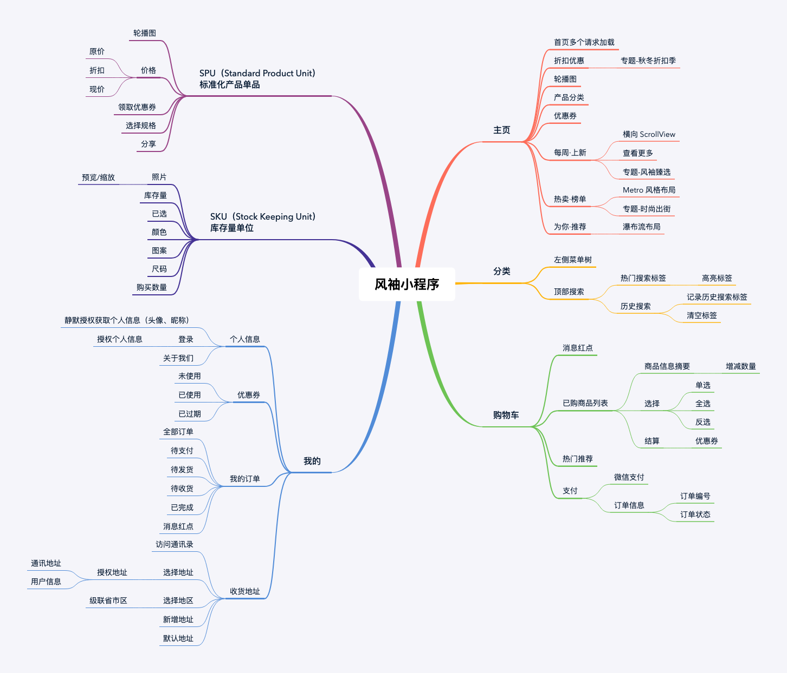

# 慕课网-风袖微信小程序

## 文档

- [文档](http://doc.cms.talelin.com/)
- [Lin UI](http://doc.mini.talelin.com/)
- 课堂练习 - 思维导图  

## 说明

1. appKey 获取方式  
[林间有风官网](https://talelin.com/) 使用qq登录

## 笔记

1. wxs 的使用技巧 相当于在 html 页面引入script
2. enum 枚举对象 通过使用对象属性来代替字符串

